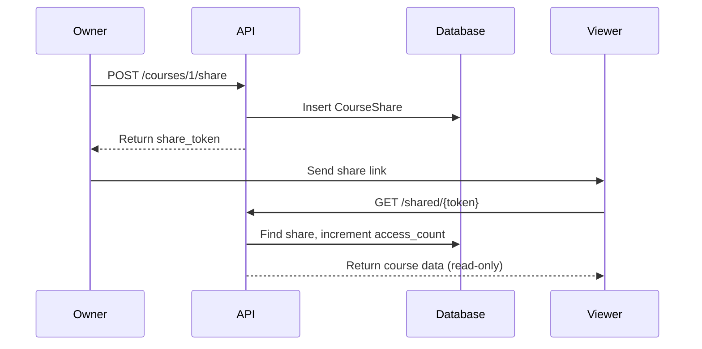

# Course Sharing Feature - In-Depth Documentation

## Overview

The Course Sharing feature enables users to share their courses with others via secure, tokenized links. This enables collaborative learning and network growth for the platform.

---

## Architecture

### Database Model: `CourseShare`

```python
class CourseShare(db.Model):
    id = db.Column(db.Integer, primary_key=True)
    course_id = db.Column(db.Integer, db.ForeignKey('course.id'))
    created_by = db.Column(db.Integer, db.ForeignKey('user.id'))
    share_token = db.Column(db.String(64), unique=True)  # Cryptographically secure
    permission = db.Column(db.String(20), default='read')  # 'read' or 'edit'
    expires_at = db.Column(db.DateTime, nullable=True)  # Optional expiry
    access_count = db.Column(db.Integer, default=0)  # Analytics
    is_active = db.Column(db.Boolean, default=True)  # Revocation flag
    created_at = db.Column(db.DateTime, server_default=db.func.now())
```

### Key Design Decisions

| Decision | Rationale |
|----------|-----------|
| **Token-based** | URLs don't expose course IDs; harder to guess |
| **Cryptographically secure** | Uses `secrets.token_urlsafe(32)` - 256 bits of entropy |
| **Soft delete** | `is_active=False` instead of delete; preserves audit trail |
| **Access tracking** | Counts views for analytics |
| **Optional expiry** | Time-limited shares for sensitive content |

---

## API Endpoints

### 1. Create Share Link

```http
POST /courses/<course_id>/share
Authorization: Bearer <token>
Content-Type: application/json

{
  "permission": "read",        // 'read' or 'edit'
  "expires_in_days": 7         // Optional, null = never expires
}
```

**Response (201 Created):**
```json
{
  "share_token": "abc123xyz...",
  "share_url": "/shared/abc123xyz...",
  "permission": "read",
  "expires_at": "2025-01-01T00:00:00"
}
```

### 2. Access Shared Course (No Auth Required)

```http
GET /shared/<share_token>
```

**Response (200 OK):**
```json
{
  "course": {
    "id": 1,
    "name": "Machine Learning 101",
    "description": "Intro to ML",
    "created_at": "2024-12-01T10:00:00"
  },
  "documents": [
    {"id": 1, "filename": "lecture1.pdf", "doc_type": "pdf"},
    {"id": 2, "filename": "notes.pdf", "doc_type": "pdf"}
  ],
  "permission": "read",
  "owner_name": "John Doe"
}
```

### 3. Get All Share Links for Course

```http
GET /courses/<course_id>/shares
Authorization: Bearer <token>
```

**Response:**
```json
[
  {
    "id": 1,
    "share_token": "abc123...",
    "permission": "read",
    "access_count": 15,
    "created_at": "2024-12-20T10:00:00",
    "expires_at": null
  }
]
```

### 4. Revoke Share Link

```http
DELETE /courses/<course_id>/share/<share_id>
Authorization: Bearer <token>
```

**Response:**
```json
{"msg": "Share link revoked"}
```

---

## Frontend Implementation

### Share Button Location
- **File:** `CoursePage.jsx`
- **Position:** Action bar alongside Generate Quiz, Flashcards, Study Guide

### Share Modal Features

1. **Automatic Link Generation**
   - Clicking "Share" triggers `handleCreateShareLink()`
   - Generates 43-character URL-safe token

2. **Copy to Clipboard**
   - One-click copy with visual feedback (checkmark icon)
   - Toast notification confirms copy

3. **Loading State**
   - Spinner while generating link
   - Prevents double-click issues

### State Variables

```jsx
const [showShareModal, setShowShareModal] = useState(false);
const [shareLink, setShareLink] = useState('');
const [isCreatingShare, setIsCreatingShare] = useState(false);
const [copied, setCopied] = useState(false);
```

### Handler Functions

```jsx
const handleCreateShareLink = async () => {
  setIsCreatingShare(true);
  try {
    const response = await apiClient.post(`/courses/${courseId}/share`, {
      permission: 'read'
    });
    const fullUrl = `${window.location.origin}/shared/${response.data.share_token}`;
    setShareLink(fullUrl);
  } finally {
    setIsCreatingShare(false);
  }
};

const handleCopyShareLink = () => {
  navigator.clipboard.writeText(shareLink);
  setCopied(true);
  setTimeout(() => setCopied(false), 2000);
  toast({ title: "Copied!" });
};
```

---

## Security Considerations

| Threat | Mitigation |
|--------|------------|
| **Token guessing** | 256-bit entropy; 2^256 possibilities |
| **Unauthorized access** | Token required; no course ID exposure |
| **Stale links** | Optional expiration; revocation support |
| **Tracking** | Access count for abuse detection |

---

## User Flow



---

## Testing Checklist

1. [ ] Share button appears on course page
2. [ ] Clicking Share opens modal
3. [ ] Link generates within 2 seconds
4. [ ] Copy button works
5. [ ] Toast confirms copy
6. [ ] Opening link in incognito shows course
7. [ ] Documents list visible
8. [ ] Owner name shown
9. [ ] Edit features hidden (read-only)

---

## Future Enhancements

1. **Edit Permission Mode**
   - Allow collaborators to add documents
   - Real-time sync of changes

2. **Password Protection**
   - Optional password for sensitive courses

3. **Email Invites**
   - Send invite emails directly from app

4. **QR Code Generation**
   - For classroom/in-person sharing

5. **Share Analytics Dashboard**
   - Track views over time
   - Geographic distribution
